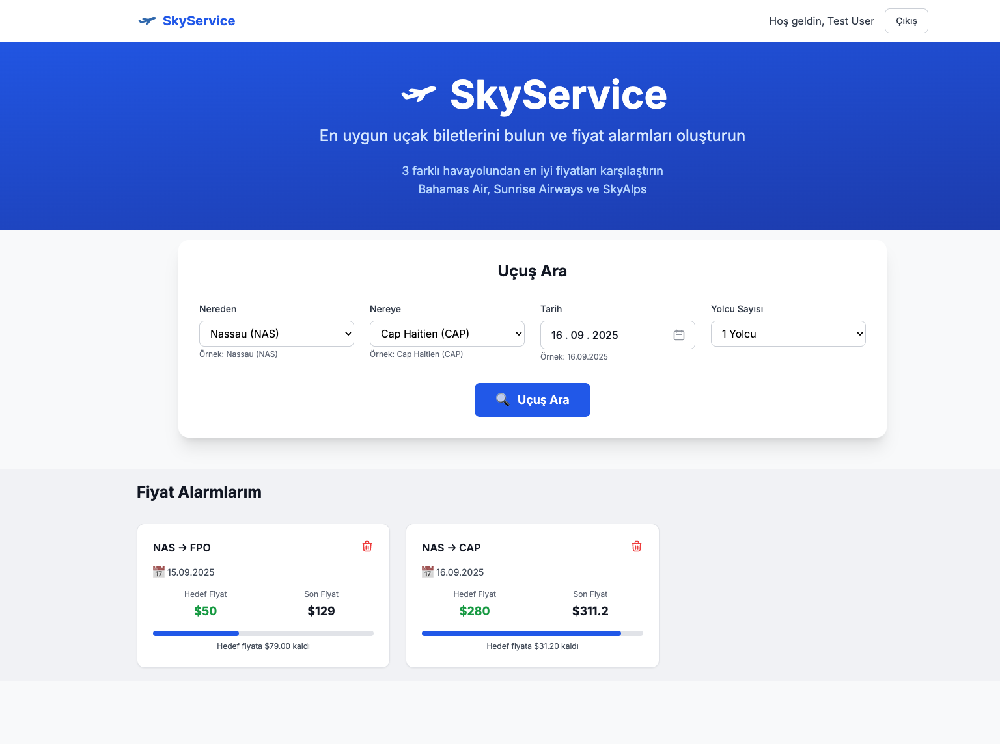
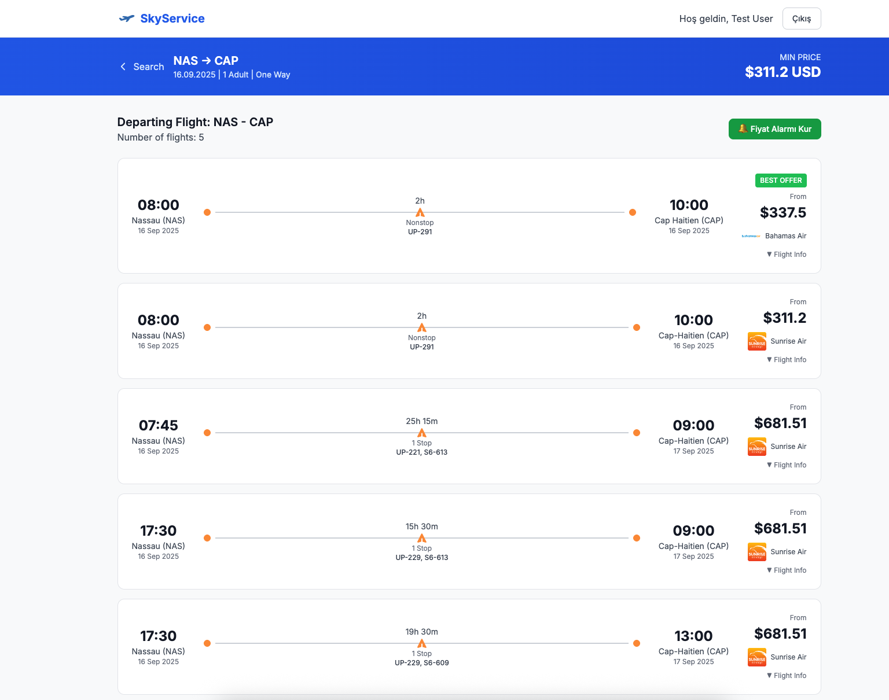

# SkyService - Uçak Bileti Arama ve Fiyat Takibi

SkyService, 3 farklı havayolundan (Bahamas Air, Sunrise Airways ve SkyAlps) uçak biletlerini arayabileceğiniz ve fiyat alarmları kurabileceğiniz modern bir web uygulamasıdır.

## 🚀 Özellikler

### ✈️ Uçuş Arama
- **Çoklu Havayolu Desteği**: Bahamas Air, Sunrise Airways ve SkyAlps havayollarından fiyat karşılaştırması
- **Gerçek Zamanlı Arama**: Canlı API entegrasyonu ile güncel fiyatlar
- **Detaylı Uçuş Bilgileri**: Kalkış/varış saatleri, süre, aktarma bilgileri
- **Farklı Ücret Seçenekleri**: Her uçuş için multiple fare class seçenekleri
- **Responsive Tasarım**: Mobil ve masaüstü uyumlu arayüz

### 🔔 Fiyat Alarmları
- **Akıllı Fiyat Takibi**: Belirlediğiniz fiyat seviyesine ulaştığında otomatik bildirim
- **Kişiselleştirilmiş Alarmlar**: Her kullanıcı için özel alarm yönetimi
- **Görsel Takip**: Hedef fiyata ne kadar kaldığını gösteren progress bar
- **Kolay Yönetim**: Alarmları görüntüleme ve silme işlemleri

### 👤 Kullanıcı Yönetimi
- **Güvenli Giriş/Kayıt**: Email ve şifre ile hesap oluşturma
- **Oturum Yönetimi**: LocalStorage ile kalıcı oturum
- **Test Hesabı**: Hızlı test için hazır hesap (test@example.com / 1234)

## 🖼️ Ekran Görüntüleri

### Ana Sayfa ve Fiyat Alarmları


### Availability Sayfası (Uçuş Listesi)



## 🛠️ Teknoloji Stack

### Frontend
- **Svelte**: Modern, reaktif JavaScript framework
- **Vite**: Hızlı geliştirme ve build aracı
- **Tailwind CSS**: Utility-first CSS framework
- **Axios**: HTTP client kütüphanesi

### Backend API
- **External API**: https://skyservice-api.onrender.com
- **Proxy Configuration**: CORS ve timeout yönetimi için Vite proxy

## 📁 Proje Yapısı

```
src/
├── components/          
│   ├── Home.svelte      # Ana sayfa
│   ├── Login.svelte     # Giriş formu
│   ├── Register.svelte  # Kayıt formu
│   ├── FlightSearch.svelte    # Uçuş arama formu
│   ├── Availability.svelte    # Uçuş sonuçları
│   └── AlarmsList.svelte      # Fiyat alarmları listesi
├── services/            # API servisleri
│   └── api.js          # API çağrıları
├── stores/             # Svelte stores
│   └── auth.js         # Kullanıcı durumu yönetimi
├── assets/             # Statik dosyalar
└── App.svelte          # Ana uygulama bileşeni
```

## 🚀 Kurulum ve Çalıştırma

### Gereksinimler
- Node.js (v16 veya üzeri)
- npm veya yarn

### Kurulum
```bash
# Bağımlılıkları yükle
npm install

# Geliştirme sunucusunu başlat
npm run dev

# Production build
npm run build

# Build önizleme
npm run preview
```

### Ortam Değişkenleri
Proje Vite proxy kullandığı için ek ortam değişkeni gerektirmez. API çağrıları `/api` prefix'i ile proxy üzerinden yönlendirilir.

## 📱 Kullanım Kılavuzu

### 1. Uçuş Arama
1. Ana sayfada "Uçuş Ara" bölümünü bulun
2. **Nereden**: Kalkış havaalanını seçin (örn: Nassau - NAS)
3. **Nereye**: Varış havaalanını seçin (örn: Cap Haitien - CAP)
4. **Tarih**: Kalkış tarihini seçin
5. **Yolcu Sayısı**: 1-9 arası yolcu sayısını belirleyin
6. "🔍 Uçuş Ara" butonuna tıklayın

### 2. Uçuş Sonuçları
- Uçuşlar fiyata göre sıralanır (en ucuz önce)
- Her uçuş kartında:
  - Kalkış/varış saatleri ve havaalanları
  - Uçuş süresi ve aktarma bilgileri
  - Havayolu logosu ve adı
  - Minimum fiyat bilgisi
- Uçuş kartına tıklayarak detaylı ücret seçeneklerini görüntüleyin

### 3. Fiyat Alarmı Oluşturma
1. Uçuş sonuçları sayfasında "🔔 Fiyat Alarmı Kur" butonuna tıklayın
2. Giriş yapmadıysanız, giriş sayfasına yönlendirilirsiniz
3. Hedef fiyatı belirleyin (sistem otomatik öneri yapar)
4. "Alarm Oluştur" butonuna tıklayın
5. Başarı mesajını bekleyin

### 4. Alarm Yönetimi
- Ana sayfada "Fiyat Alarmlarım" bölümünde tüm alarmlarınızı görüntüleyin
- Her alarm kartında:
  - Rota bilgileri (kalkış → varış)
  - Kalkış tarihi
  - Hedef fiyat vs mevcut fiyat karşılaştırması
  - Progress bar ile hedefe ne kadar kaldığı
  - Silme butonu (🗑️)

## 🎨 Tasarım Özellikleri

### Renk Paleti
- **Primary**: Mavi tonları (#0ea5e9, #0284c7)
- **Success**: Yeşil tonları (#22c55e, #16a34a)
- **Warning**: Turuncu tonları (#f97316, #ea580c)
- **Neutral**: Gri tonları

### Responsive Breakpoints
- **Mobile**: < 768px
- **Tablet**: 768px - 1024px
- **Desktop**: > 1024px

### Animasyonlar
- Hover efektleri
- Loading spinners
- Smooth transitions
- Micro-interactions

## 🔧 API Endpoints

### Kullanıcı İşlemleri
- `POST /user/login` - Kullanıcı girişi
- `POST /user/register` - Kullanıcı kaydı
- `GET /user/alarms/{userId}` - Kullanıcı alarmları
- `POST /user/alarms` - Alarm oluşturma
- `DELETE /user/alarms/{alarmId}` - Alarm silme

### Uçuş İşlemleri
- `GET /portGroups` - Havaalanı grupları
- `GET /portsByCountry/{portCode}` - Ülkeye göre havaalanları
- `POST /availability` - Uçuş arama

## 🐛 Hata Yönetimi

### Otomatik Yeniden Deneme
- Port grupları yüklenirken hata olursa 10 saniyede bir yeniden dener
- Kullanıcıya spinner ve deneme sayısı gösterilir
- Başarılı yükleme sonrası otomatik durur

### Kullanıcı Dostu Mesajlar
- Network hataları için açıklayıcı mesajlar
- Form validasyon hataları
- API hata durumları için fallback'ler

## 🔒 Güvenlik

### Veri Koruması
- Şifreler backend'de hash'lenir
- LocalStorage'da sadece gerekli kullanıcı bilgileri saklanır
- API çağrıları proxy üzerinden güvenli şekilde yapılır

### CORS Yönetimi
- Vite proxy ile CORS sorunları çözülür

## 🚀 Deployment

### Build Komutu
```bash
npm run build
```

### Statik Hosting
Proje statik dosyalar olarak build edilir ve herhangi bir statik hosting servisinde (Netlify, Vercel, GitHub Pages) çalıştırılabilir.


## 📞 İletişim

Proje hakkında sorularınız için GitHub Issues kullanabilirsiniz.

---

**SkyService** - En uygun uçak biletlerini bulmanın en kolay yolu! ✈️